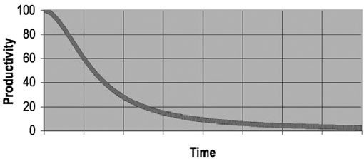

# Clean Code: A Handbook of Agile Software Craftsmanship
### by Robert C. Martin
---
> **목차**   
[Chapter 1](#chapter-1-clean-code)  
[Chapter 2](#chapter-2-meaningful-names)   

## Chapter 1: Clean Code
Copilot 등과 같이 코드를 자동으로 생성하는 시대가 왔지만, 그럼에도 코드의 중요성은 변하지 않는다. 이는 **기계가 실행할 정도로 상세하게 요구사항을 표현하는 작업**이 바로 프로그래밍이고, 이 결과가 바로 코드이기 때문이다. 그렇기에 지금도, 그리고 앞으로도 코드는 항상 존재할 것이며, 또한 항상 중요할 것이다.  

그렇다면 *나쁜 코드*는 어떤 결과를 가져오게 될까? 흔히 **스파게티 코드**라고도 부르는 코드들은 항상 우리를 고난에 빠뜨린다. **고행(Wading)** 이라고도 부르는 이 고난은 종국에는 너무나도 커져 감당이 불가능한 정도로 커지기도 한다. 

### 나쁜 코드의 대가
  
나쁜 코드는 우선 개발속도를 크게 떨어뜨린다. 코드가 쌓일 수록 기능을 추가하기 위해 코드를 '해독'하는 과정이 필요하게 되고, 이로 인해 생산성이 급격하게 하락하게 된다. 결과적으로는 위의 그림과 같이 생산성이 0에 가까워지게 된다.  

그 이후, 아주 복잡해진 코드를 해결하기 위해 재설계에 돌입하기도 한다. 이 과정은 아주 길고 지루하며, 결과적으로 재설계된 시스템이 이전 시스템을 따라잡을 즈음이 되면 재설계된 시스템마저 엉망이 되기도 한다. 

이러한 점을 보았을 때, **시간을 들여 깨끗한 코드를 만드는 노력**이 비용 절감, 그리고 전문가로서 살아남는 길이라는 것이 된다. 

이러한 나쁜 코드를 만들지 않을 책임은 그 누구도 아닌 우리 프로그래머들에게 있다. 이는 나쁜 코드의 위험을 알지 못하는 관리자의 말을 따르는 것은 전문가답지 못한 행동이며, 또한 프로그래머들은 프로젝트의 계획 과정에 아주 깊숙하게 관여하기 때문에 실패에도 책임이 있다. 

우리가 나쁜 코드를 우선 양산하고, 이후에 좋은 코드로 고치는 과정은 겉으로 보기엔 효율적으로 보인다. 하지만 결과적으로는 속도가 오히려 늦어지며, 따라서 우리가 기한을 맞출 가장 좋은 방법은 바로 **항상 코드를 최대한 깨끗하게 유지하는 것**이다.

그렇다면 *깨끗한 코드*란 무엇일까? 여러 사람들이 이 정의에 대해 고민하였고, 그에 대한 답변 역시 굉장히 많다. **Bjarne Stroustrup**은 '우아하고 효율적으로 한 가지를 제대로 하는 코드'라고 하였고, **Grady Booch**는 가독성을 강조하였다. **Dave Thomas**의 경우엔 **다른** 사람이 쉽게 고칠 수 있는 코드라고 하였으며, **Michael Feathers**의 경우에는 '주의깊게 작성한 코드'라고 말한다. 

### 깨끗한 코드란 무엇인가
그렇다면 이 책에서는 깨끗한 코드를 작성하는 방식을 어떻게 제안할지 알아보자.  
우선 우리는 코드의 저자이다. 그러므로 코드의 독자와 잘 소통할 **책임**이 있다. 우리가 코드를 작성할 때도 대부분의 작업은 기존 코드를 읽는 것에서 시작한다. 읽기 쉬운 코드는 그래서 중요하다.  
또한, 코드는 지속적으로 개선되어야 한다. 지속적인 개선은 코드를 나빠지지 않게 만들고, 많은 시간과 노력이 필요하지도 않다. 

### 결론
위에서 제시한 방법들은 뛰어난 프로그래머가 생각하는 방식을 표현한 것이다. 하지만 이를 알기만 하는 것은 우리를 뛰어난 프로그래머로 만들지 않는다. 항상 이런 기법들을 반복적으로 연습하고, 사용하며 체득해야 좋은 프로그래머가 될 수 있다. 

## Chapter 2: Meaningful Names
코드에서 우리가 항상 하는 일 중 하나는 **이름을 붙이는 일**이다. 변수, 함수, 인수와 클래스 등 아주 많은 곳, 더 나아가 소스 파일과 파일이 포함된 디렉터리까지 이름을 붙인다. 이 챕터에서는 이런 이름을 잘 짓는 간단한 규칙을 소개한다.   

### 의도를 분명하게 밝혀라
변수와 함수, 클래스 등의 이름은 존재 이유와 기능, 사용 방법 등의 **의도**를 잘 표현해야 한다. 
```Java
int d; // 경과 시간(단위: 날짜)

int fileAgeInDays;
```
위 코드에서 첫 코드와 다음 코드에서의 변수명은 큰 차이를 보인다. `d`는 어떤 의도도 담고있지 않지만, `fileAgeInDays`는 분명한 의도를 담고 있다. 이러한 의도를 담는 이름은 코드의 **함축성**을 크게 발전시킨다. 같은 코드 안에 더 많은 양의 정보를 담을 수 있고, 이는 코드의 독자가 코드만을 읽고도 쉽게 코드의 역할을 추측할 수 있게 한다. 단순한 코드도 중요하지만, 같은 단순한 코드 형태에서도 더 많은 정보를 담는 것 역시 중요하다는 것이다. 

### 그릇된 정보를 피하라
프로그래머들은 변수명을 통해 그릇된 정보를 주면 안 된다. 널리 쓰이는 특별한 의미를 가진 약어나, 프로그래머들에게 주로 사용되는 특별한 의미의 단어들(e.g. list, vector, etc.)을 다른 의미로 사용한다면 코드의 의미를 흐린다. 그리고 흡사한 이름을 가진 전혀 다른 기능의 이름은 큰 혼동을 주게된다.  
유사한 개념은 유사한 표기법으로 표현하는 것 역시 중요하다. 최신 IDE 등은 코드 자동 완성 기능을 대부분 지원하는데, 이 과정에서 표기법을 통해 쉽게 메서드를 선택할 수 있도록 하면 개발자들에게 매우 유용하다.  

### 의미 있게 구분하라
단순히 컴파일러, 혹은 인터프리터 상의 오류를 피하기 위해 이름을 단순히 변경하는 것은 피해야 한다. 연속된 숫자, 혹은 불용어를 붙이는 것은 어떤 의도도 추가하지 못한 채, 단순히 이름만 변경하는 것이다. 아래의 코드를 보자.
```Java
// 1번
public static void copyChars(char a1[], char a2[]) {
    for (int i = 0; i < a1.length; i++) {
        a2[i] = a1[i];
    }
}

// 2번
public static void copyChars(char source[], char destination[]) {
    for (int i = 0; i < source.length; i++) {
        destination[i] = source[i];
    }
}
```
1번 코드와 2번 코드의 차이는 단순히 인수 이름을 의도를 담아 작성한 것에 불과하다. 하지만 이 과정을 통해 코드가 의미하는 것이 무엇인지가 분명해지는 것을 볼 수 있다.  
불용어 역시 사용하지 않는 것이 좋다. `NameString`과 `Name`, `Customer`과 `CustomerInfo`의 차이는 이름만 보고는 알기 어렵다. 단순히 에러를 피하기 위해 이름을 바꾸는 것이 아닌, 의미를 쉽게 알 수 있도록 구분하는 것이 중요하다.  

### 발음하기 쉬운 이름을 사용하라
프로그래머들은 사람이며, 사람들은 대부분 발음하기 쉬운 단어들을 처리하는데 더 능숙하다. 발음하기 어려운 단어들은 토론하기도 어렵다. 아래의 코드를 비교해보자. 
```Java
// 1번
class DtaRcrt102 {
    private Date genymdhms;
    private Date modymdhms;
    private final String pszqint = "102";
    /* ... */
}

// 2번
class Customer {
    private Date generationTimestamp;
    private Date modificationTimestamp;
    private final String recordId = "102";
    /* ... */
}
```

### 검색하기 쉬운 이름을 사용하라
코드에 문제가 생겼을 때, 검색을 통해 쉽게 찾아야 한다는 관점에서 보면 긴 이름이 짧은 이름보다 좋다. 이 책에서는 **"이름 길이는 범위 크기에 비례해야 한다."**라는 규칙을 제시한다. 검색을 통해 우리가 원하는 변수를 가려내기 위해서는 긴 이름이더라도 짧은 이름보다 더 유용하다는 것이다. 

### 인코딩을 피하라
과거에는 접두어, 접미어 등을 사용한 표기법이 굉장히 중요하게 여겨졌다. 하지만 지금은 컴파일러가 타입을 강제하며, 아주 많은 타입이 존재하고 클래스와 함수는 점차 단순한 형태로 바뀌어간다. 이런 상황에서 인코딩은 독자를 피곤하게 할 뿐, 큰 장점을 가지지 않는다. 

### 자신의 기억력을 자랑하지 마라
전문가 프로그래머들은 **명료함이 최고**라는 사실을 이해하고 프로그래밍을 한다. 코드를 읽으면서 독자가 변수 이름을 변환해야 하는 것은 바람직하지 못하다. 남들이 이해하는 코드를 만들기 위해서는 자신만이 기억하는 이름이 아닌, 모두가 보기만 해도 이해할 수 있는 이름을 사용해야 한다. 

### 클래스와 메서드 이름
클래스 이름과 객체 이름은 명사/명사구가 적합하다. 반면, 메서드 이름은 동사나 동사구가 적합하다. 

### 기발한 이름은 피하라
재미있는 이름보다는 명료한 이름을 선택하라. 특정 문화에서만 사용되는 속어, 혹은 구어체의 변수명은 피하고, 분명하고 솔직하게 의도를 표현하라.

### 한 개념에 한 단어를 사옹하라
같은 개념을 다른 단어로 표현할 경우 혼란이 일어날 수 있다. 일관성이 있는 어휘를 사용하여 단어와 개념을 대응시킬 수 있도록 하자.

### 말장난을 하지 마라
한 단어를 두 가지 목적으로 사용하면 안 된다. 단순히 '일관성'만을 추구하는 것이 아니라, 맥락을 파악할 수 있도록 서로 다른 목적에는 다른 단어를 대응시켜야 한다. 

### 해법 영역에서 가져온 이름을 사용하라
코드의 독자 역시 프로그래머이다. 전산 용어, 알고리즘 이름 등을 활용하여 이름을 지으면 이름의 의미를 쉽게 파악할 수 있을 것이다. **기술 개념에는 기술 이름이 가장 적합한 선택이다.**

### 문제 영역에서 가져온 이름을 사용하라
적절한 프로그래밍 영역의 단어가 없다면 문제 영역의 단어를 사용한다. 문제 영역 개념과 관련이 깊은 코드 역시 문제 영역에서 이름을 가져와야 한다. 

### 의미 있는 맥락을 추가하라
적절한 접두어를 추가하여 맥락을 추가하라. 대부분 단어들은 다의어이기 때문에 단어 하나만 사용할 경우 맥락을 파악하기 어려울 수 있다. 이때 마지막으로 맥락을 추가하기 위해 적절한 접두어를 추가하여 이해가 쉽도록 한다. 

### 불필요한 맥락을 없애라
일반적으로 의미가 분명한 경우에는 짧은 이름이 긴 이름보다 좋다. 따라서 불필요한 맥락을 추가하지 않도록 주의한다. 
